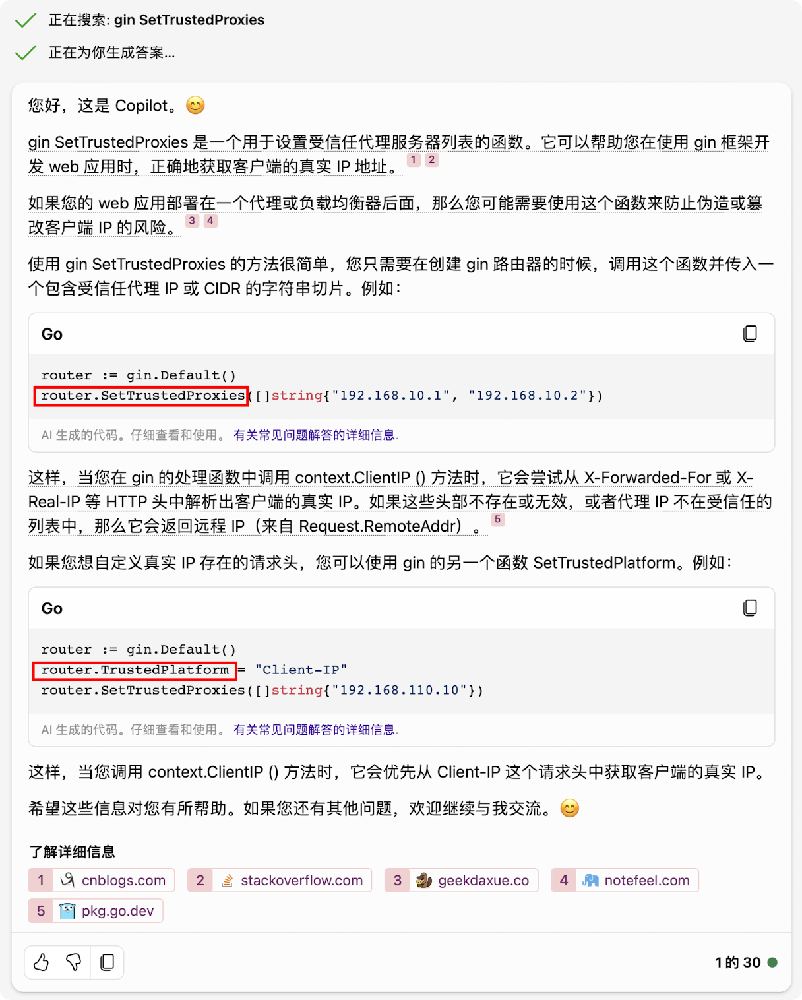
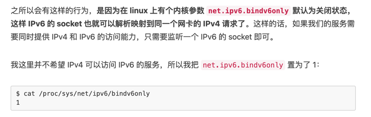

## 参考

notes/Golang/WEB/Gin.wps

## ip相关

- Context.ClientIP()
- Engine.TrustedPlatform
- Engine.SetTrustedProxies()
  

## 绑定ipv6

### linux内核参数 net.ipv6.bindv6only

- [IPv4 也是可以访问 IPv6 服务的](https://ms2008.github.io/2018/12/10/ipv6-bindv6only/)

