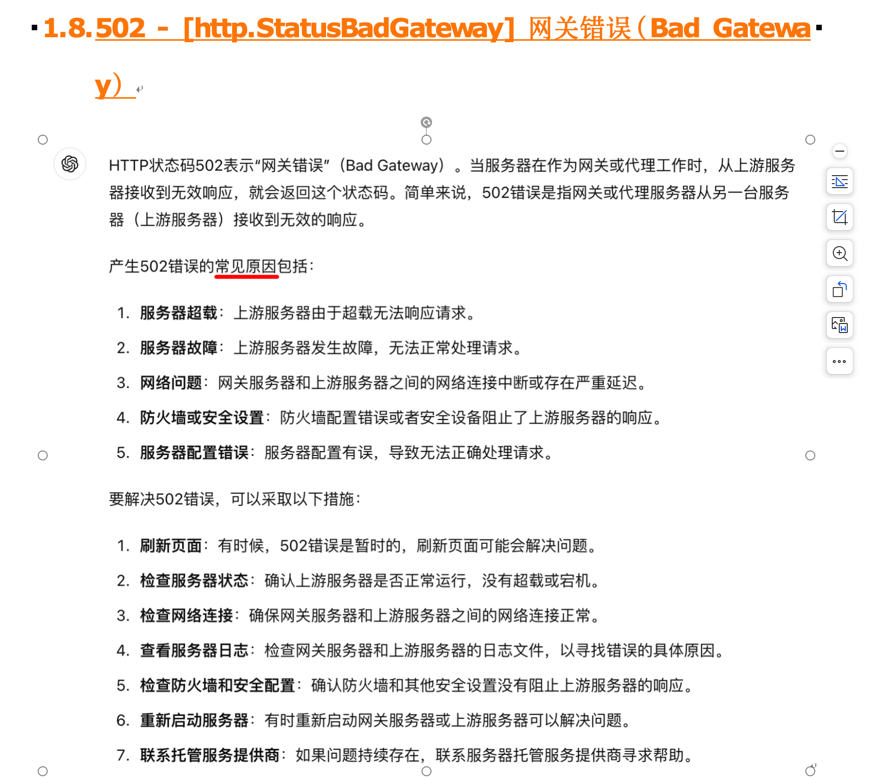

## 参考

- [HTTP 请求转发在Go当中的实践](https://zhuanlan.zhihu.com/p/349020346)
- notes/Golang/WEB/proxy（代理; forward）.wps

## 建议

代理请求失败时，建议返回状态码502(http.StatusBadGateway, 网关错误).

## 请求转发的可能原因

- linux服务器 请求转发给 Windows机器，报错: 超时timeout，原因: Windows机器的域防火墙（入站规则）拦截了请求.

## slb（负载均衡器）

- [项目实战：用 Go 创建一个简易负载均衡器](https://mp.weixin.qq.com/s/pe0CQa3tdrUmC86OSRBNeg)
- [demo](https://github.com/kasvith/simplelb/)
- [ChatGPPT（有问题，仅供参考）](https://chatgpt.com/share/2c4c849e-c6a7-4b8b-b4fa-9cddd80c2fbc)

