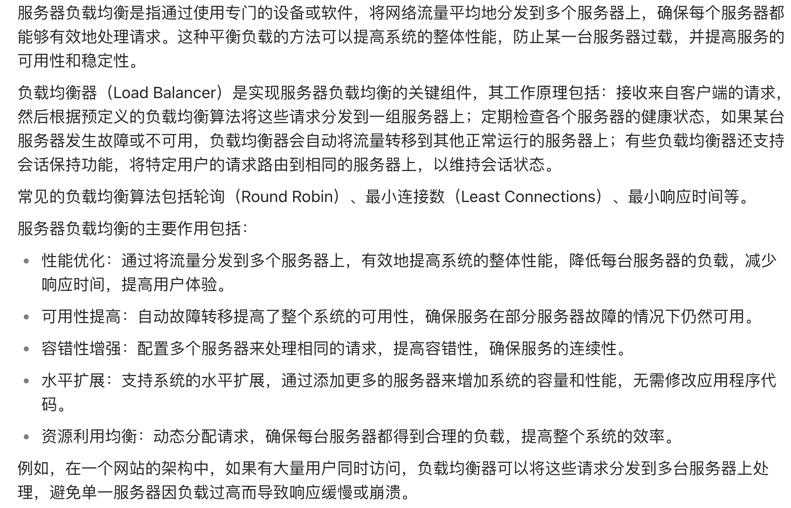

## slb: 服务器负载均衡（Server Load Balancing）

- [项目实战：用 Go 创建一个简易负载均衡器](https://mp.weixin.qq.com/s/pe0CQa3tdrUmC86OSRBNeg)
- [demo](https://github.com/kasvith/simplelb/)
  建议直接使用: notes/_GolandProjects/simplelb-master
- [ChatGPPT（有问题，仅供参考）](https://chatgpt.com/share/2c4c849e-c6a7-4b8b-b4fa-9cddd80c2fbc)

## TODOs

- 创建 Backend 实例时，加上一个用于验证服务是否健康的url（可选，默认通过 net.DialTimeout 验证）.

