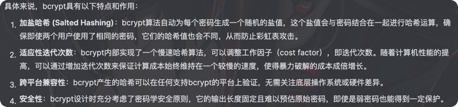

## 简介

在Go语言中，bcrypt是一种基于Blowfish加密算法的密码哈希函数库，通常用于安全地存储密码。
bcrypt提供了一个单向的加密方式，意味着加密后的数据不能轻易解密，只能通过验证输入是否匹配哈希值来进行密码验证。

## 参考
- [Go实验室：每周一更｜crypto｜Golang中的加密利器](https://mp.weixin.qq.com/s/09g1_ol_y074XItb4dC9VQ)

