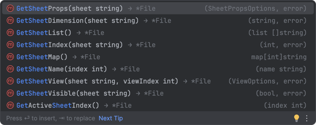
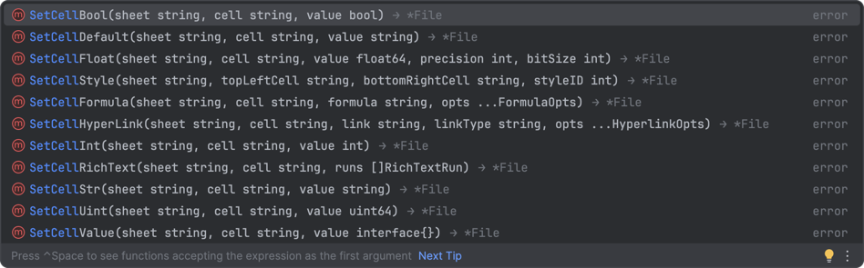

## 参考
github(17.1k Star): 
    https://github.com/qax-os/excelize
官网快速开始: 
    https://xuri.me/excelize/zh-hans/base/installation.html

## 简介
Excelize 是 Go 语言编写的用于操作 Office Excel 文档基础库，基于 ECMA-376，ISO/IEC 29500 国际标准。
可以使用它来读取、写入由 Microsoft Excel™ 2007 及以上版本创建的电子表格文档。
支持 XLAM / XLSM / XLSX / XLTM / XLTX 等多种文档格式，高度兼容带有样式、图片(表)、透视表、切片器等复杂组件的文档，并提供流式读写 API，用于处理包含大规模数据的工作簿。

功能包括：
* 创建 Sheet
* 修改 Active Sheet
* 设置、获取单元格的值
* 另存为
* 打开已有文件
* 增加 Chart
* 增加 图片
* ...

## row（行）
- 从 1 开始
- 有效范围: [1, 1048576]

## column（列）
- 从 1 开始
- 有效范围: [1, 16384]

## 开档可能返回的error
excelize.ErrWorkbookFileFormat: 格式不支持.

## Save
- File.Save(opts ...Options) error
- File.SaveAs(name string, opts ...Options) error

## Sheet
- File.NewSheet(sheet string) (int, error)  
- File.SetActiveSheet(index int)  

#### Sheet Dimension（工作表的使用范围）
- File.GetSheetDimension(sheet string) (string, error)

## Cell
- File.SetCellValue(sheet, cell string, value interface{}) error

#### Cell Value（单元格值）

