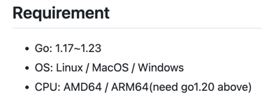

## Sonic简介

一个速度奇快的 JSON 序列化/反序列化库，由 JIT （即时编译）和 SIMD （单指令流多数据流）加速。

### 文档

- [官方文档](https://github.com/bytedance/sonic/blob/main/README_ZH_CN.md)
- [Go语言JSON解析届顶流：Sonic](https://mp.weixin.qq.com/s/Ij5wNjNZ6rRbQqTYIvP_aw)

### 限制!!!

  
Richelieu: 可以直接看源码，从 sonic 源码中全局搜索 "only support".

- Amd64 CPU: 需要支持AVX指令集（AVX instruction set）
- Arm64 CPU: 暂未发现有其他要求

### 兼容性

- ConfigDefault   
  在支持 sonic 的环境下 sonic 的默认配置（EscapeHTML=false，SortKeys=false等）。行为与具有相应配置的 encoding/json 一致，一些选项，如
  SortKeys=false 将无效。
- ConfigStd  
  在支持 sonic 的环境下与标准库兼容的配置（EscapeHTML=true，SortKeys=true等）。行为与 encoding/json 一致。
- ConfigFastest   
  在支持 sonic 的环境下运行最快的配置（NoQuoteTextMarshaler=true）。行为与具有相应配置的 encoding/json 一致，某些选项将无效。

### 对map的键排序（性能损失约10%，默认不启用）

(1) 最简单的一种方法: 直接使用 sonic.ConfigStd .
(2) 自行创建 sonic.API实例(SortMapKeys).

### HTML 转义（性能损失约15%，默认不启用）

(1) 最简单的一种方法: 直接使用 sonic.ConfigStd .
(2) 自行创建 sonic.API实例(EscapeHTML).

### problems

#### 多次序列化同一map（无序的），希望结果一致

sonic.ConfigDefault:    多次实验（1000000），发现生成的json字符串一致.
sonic.ConfigStd:        生成的json字符串必定一致.

结论：稳一点，还是使用 sonic.ConfigStd 作为API吧.
